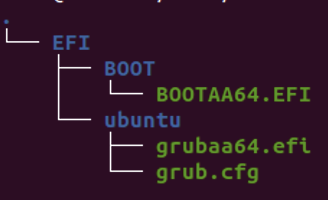

# Linux内核

裁剪内核的时候，如果想要显著减少内核的大小，要着重关注device drivers、file system、kernel hack等选项，
这些里面部分东西的功能在本次实验中不会用到，但是非常占空间，所以可以删去。

# 初始内存盘

需要稍微熟悉一下Linux中部分syscall的调用方法。

# 初识Boot

## 第一组问题

1. 使用异或操作清零寄存器。这样做相比使用`mov`操作机器码更短，
而且`xor`操作访问的都是通用寄存器，执行速度会更快。
2. `jmp $`为死循环，此时一旦有中断发生，则去执行中断程序。
`$`运算符为当前地址计数器，所以`jmp $`为死循环。
3. 寻找的地址是`es << 4 | di`，即`es`左移4位再加上`di`，
这种寻址方式在实模式中非常重要。
4. org会指定程序被载入内存时的起始地址，在boot的时候，BIOS会将MBR读入`0x7c00`，
然后进行后续引导。所以需要在程序开头写上`org 0x7c00`。

## 第二组问题

1. 完成增加一行输出`"I am OK!"`任务。

# 思考题

- **第1题** Linux 的发行版说简单点就是将 Linux 内核与应用软件做一个打包。
Linux是一个操作系统最底层的核心及其提供的核心工具。
为了让使用者能够接触到 Linux，很多的商业公司或非营利团体， 就将Linux Kernel(含 tools)与可运行的软件整合起来，加上自己具有创意的工具程序， 这个工具程序可以让用户以光盘/DVD或者透过网络直接安装/管理 Linux 系统。这个集合称为Linux发行版。
- **第2题** 不需要这么做。因为内核模块是一个能在内核运行时拓展内核功能的目标文件，当不需要该模块的时候就可以卸载掉，在boot的时候不起作用。裁剪内核的时候可以把这些模块全部删掉。（如果完成了一次完整编译后，只删掉`[M]`选项后再进行编译，速度的确会快很多）
- **第3题**
  - 树莓派启动时，首先会关闭ARM核，打开GPU核
  - GPU执行ROM中的第一阶段的bootloader，这部分程序会加载第二阶段的bootloader（即`bootcode.bin`）。
  - `bootcode.bin`会启用SDRAM，读取第三阶段的bootloader（即`loader.bin`）到RAM中并运行。
  - `loader.bin`会读取GPU固件（即`start.elf`）。
  - `start.elf`继续读取`config.txt`（配置文件），`cmdline.txt`（内核启动时传入的内核的命令）和`kernel.img`
- **第7题** 简单来说，启动时会首先读取GRUB位于MBR的`boot.img`（stage 1），随后如果有`core.img`（stage 1.5）则装载`core.img`并由其装载stage 2，如果没有则直接装载stage 2。当stage 2启动后，它将呈现一个界面来让用户选择启动的操作系统。总之，这一步最后会选择一个内核进行启动，将控制交给内核，结束GRUB部分的工作。
- **第8题** UEFI启动时，先进行硬件自检，自检后初始化硬件，随后UEFI不从MBR读取代码，而是从NVRAM中读取启动项（boot entries）（启动项例如`\EFT\BOOT\BOOTX64.EFI`），此后会启动该EFI应用程序。  
EFI分区内容如下：  

- **第9题** 因为手机等ARM设备通常是高度定制化的，基本上没有更换各种各样硬件设备的需求，所以没必要使用UEFI启动。（但是如果想要让ARM芯片在PC类产品中使用，那多半需要使用UEFI启动，现在的ARM Linux kernel也支持UEFI）